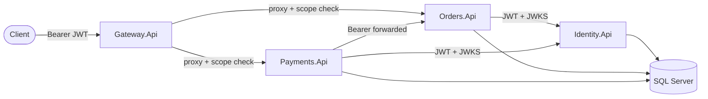

# Risk Gateway Platform

Sample **.NET 10** distributed API platform: an **API gateway** (YARP) in front of **Identity**, **Orders**, and **Payments** services. Clients authenticate with **OAuth2-style** client credentials and **JWT** access tokens; scopes control access to downstream routes. The design follows **clean architecture** (Api → Application → Infrastructure) for the business services and shared **building blocks** for cross-cutting concerns.

## Architecture



- **Gateway** validates JWTs using Identity’s **JWKS**, enforces **scope** policies per route, applies **rate limiting**, and forwards requests with a **correlation id**.
- **Identity** issues access tokens (`client_credentials`, `refresh_token`), stores clients and refresh tokens, and exposes `/.well-known/jwks.json`.
- **Orders** and **Payments** validate the same JWT audience/issuer and load signing keys from JWKS. **Payments** calls **Orders** over HTTP (with the caller’s bearer token forwarded) so a payment can only be created when the order exists and **amount/currency match**.

## Repository layout

| Path | Description |
|------|-------------|
| `src/Gateway/Gateway.Api` | YARP reverse proxy, auth, rate limits |
| `src/Identity/` | Identity.Api, Application, Infrastructure |
| `src/Services.Orders/` | Orders.Api, Application, Infrastructure (EF Core) |
| `src/Services.Payments/` | Payments.Api, Application, Infrastructure (EF Core + HTTP to Orders) |
| `src/BuildingBlocks/` | Logging (Serilog), observability (OpenTelemetry), errors, correlation id, shared **IdentityJwksProvider** |
| `src/Shared.Contracts/` | DTOs shared between services |
| `docker/docker-compose.yml` | Full stack: SQL Server, Seq, Redis, all APIs |
| `tests/` | Gateway, Identity, Orders/Payments tests |

The solution file is `RiskGatewayPlatform.slnx`.

## Prerequisites

- [.NET 10 SDK](https://dotnet.microsoft.com/download)
- For Docker: [Docker Desktop](https://www.docker.com/products/docker-desktop/) (or compatible engine)

## Run with Docker Compose

From the repository root:

```bash
docker compose -f docker/docker-compose.yml up --build
```

Exposed ports (host):

| Service | Port | Notes |
|---------|------|--------|
| **gateway-api** | [http://localhost:7000](http://localhost:7000) | Public entry point for `/orders` and `/payments` |
| **identity-api** | [http://localhost:7001](http://localhost:7001) | Token and JWKS (usually not called directly by end users when using the gateway) |
| **orders-api** | [http://localhost:7002](http://localhost:7002) | Direct access for debugging |
| **payments-api** | [http://localhost:7003](http://localhost:7003) | Direct access for debugging |
| **Seq** | [http://localhost:5341](http://localhost:5341) | Log UI (no auth in compose) |
| **SQL Server** | `localhost:1433` | `sa` / `Your_password123` (change for anything beyond local dev) |

Migrations run automatically when Orders and Payments start (non-testing environments).

Infrastructure also includes **Redis** (reserved for future use; not required for the default HTTP flow).

## Get an access token

Call Identity’s token endpoint (example uses seeded **test** client):

```bash
curl -s -X POST http://localhost:7001/connect/token ^
  -H "Content-Type: application/x-www-form-urlencoded" ^
  -d "grant_type=client_credentials&client_id=test-client&client_secret=test-secret&scope=orders.read orders.write payments.read payments.write"
```

(On macOS/Linux, replace `^` with `\` or use a single line.)

Seeded clients (see `Identity.Api` persistence seeding):

| `client_id` | `client_secret` | Scopes (subset) |
|-------------|-----------------|-----------------|
| `test-client` | `test-secret` | `orders.read`, `orders.write`, `payments.read`, `payments.write` |
| `gateway-client` | `gateway-secret` | Same as above |

Use the `access_token` value as `Authorization: Bearer …` on the **gateway** (port **7000**).

## Call the API through the gateway

Examples (replace `TOKEN` with your JWT):

```bash
# List orders
curl -s http://localhost:7000/orders -H "Authorization: Bearer TOKEN"

# Create order (JSON body)
curl -s -X POST http://localhost:7000/orders ^
  -H "Authorization: Bearer TOKEN" ^
  -H "Content-Type: application/json" ^
  -d "{\"reference\":\"INV-001\",\"amount\":99.50,\"currency\":\"USD\"}"

# Create payment (order must exist; amount/currency must match the order)
curl -s -X POST http://localhost:7000/payments ^
  -H "Authorization: Bearer TOKEN" ^
  -H "Content-Type: application/json" ^
  -d "{\"orderId\":\"<order-guid>\",\"amount\":99.50,\"currency\":\"USD\"}"
```

Gateway routes enforce scopes, for example:

- `GET /orders`, `GET /orders/{id}` → `orders.read`
- `POST /orders` → `orders.write`
- `GET /payments`, `GET /payments/{id}` → `payments.read`
- `POST /payments` → `payments.write`

Health checks: `GET /health` and `GET /ready` on each service.

## Run locally without Docker

1. Ensure **SQL Server** is available (e.g. LocalDB) and connection strings in `appsettings.json` under **Identity**, **Orders**, and **Payments** match your environment.
2. Start services in dependency order: **Identity** → **Orders** → **Payments** → **Gateway**.
3. Point **Payments** at Orders via `Services:Orders:BaseUrl` and each API at Identity JWKS via `Identity:JwksUrl`.
4. The gateway’s default `appsettings.json` uses Docker-style hostnames for clusters; for host debugging, override **`ReverseProxy:Clusters`** (and `Identity:JwksUrl`) in **Development** settings or user secrets so destinations use `http://localhost:7002/` and `http://localhost:7003/`.

## Build and test

```bash
dotnet build RiskGatewayPlatform.slnx
dotnet test RiskGatewayPlatform.slnx
```

## Security notes

This repository is a **reference / learning** layout. Before production use you should harden **secrets**, **TLS**, **token lifetimes**, **rate-limit tuning**, **Seq authentication**, database credentials, and CORS/host filtering. Do not expose Seq or SQL with default compose credentials on a public network.

## License

If you open-source this repo on GitHub, add a `LICENSE` file and reference it here.
